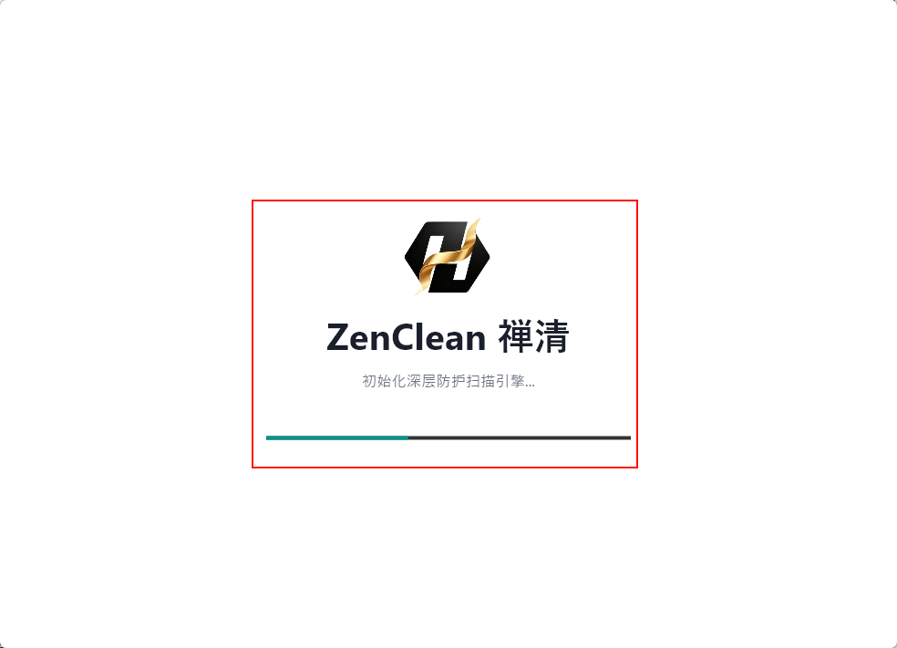

# ZenClean (禅清) - 互为螺旋



现代 Windows C 盘深度清理与极致优化工具 —— 融合 AI 智能分诊与极客底层爆破，让您的系统回归“禅”意般的纯净。

[](https://github.com/hwdemtv/ZenClean)
[](https://www.python.org/)
[](https://flet.dev/)
[](LICENSE)

## ✨ 核心特性 (Core Features)

### 🤖 AI 智能深度清理与时光隔离舱
- **靶向云端研判**: 接入云端大语言模型，精准评估系统冗余、应用残留与无效日志的风险等级，杜绝误报误删。
- **时光机双核隔离舱**: 提供“72 小时反悔期”。误删文件支持一键原路恢复；过期隔离项目由后台守护线程自动静默粉碎。
- **动态数据大屏**: 内置精美饼图与实时清理倒吸动效，C 盘健康状况与 AI 算力监控一目了然。

### 🚚 大厂应用无损极客搬家
- **底层透明映射**: 针对微信、QQ、Docker、VSCode 扩展等“C 盘杀手”，采用 Windows NTFS Junction 技术进行底层物理搬运。
- **零感知运行**: 搬移至 D 盘后，C 盘原有路径将生成透明软连接。应用软件**无需重装、无需修改任何配置**即可照常运行。
- **进程级防线**: 搬家前自动侦测并挂起活跃进程，严格的容量预检与全量校验，支持随时一键无损退防。

### ⚡ 深空级系统补丁粉碎 (高危)
- **Windows 更新缓存清剿**: 自动化调用 `dism /StartComponentCleanup` 接口清剿失效的 Component Store。
- **$PatchCache 物理强剪**: 独家深入系统禁区，强接管 `msiserver` (Windows Installer) 服务，对陈年补丁进行寿命鉴定（365天安全隔离），一键释放海量空间。

### 🛡️ 系统级深度融合
- **多实例 IPC 阻断与唤醒**: 基于 TCP 回环的单实例守护机制。如果从右键菜单重复启动，将自动唤醒已运行的主界面并下发扫描指令。
- **静默预警与开机驻留**: 接入系统托盘 (Tray) 驻留，并注册系统任务计划程序 (schtasks)，在 C 盘爆仓时投递原生 Toast 通知。
- **UAC 动态提权**: 核心破拆动作自动触发管理员盾牌提权请求；若拒绝提权，则自动降级启动安全浏览模式，不阻断基本使用。

## 💡 为什么选择 ZenClean? (Philosophy)

我们摒弃传统清理软件动辄扫出数十 GB “假面垃圾”（如浏览器 Cookies、必要的预编译库）的做法。我们的核心理念是：**性能优先、零感知干扰、极客级深度**。
1. **不碰敏感核心**：我们绝不为了好看的数字去清理您的登录态、表单历史或 .NET 框架预编译文件（导致冷启动变慢）。
2. **靶向精准打击**：系统更新残留、NPM/PIP/Docker 开发级废弃缓存、庞大且日益膨胀的聊天记录池，这才是我们的目标。

---

## 🎨 视觉与 UI 设计
基于 `Flet` (Flutter under Python) 打造的双轨响应式主题：
- 🌙 **赛博机甲暗色模式**: 深邃的蓝绿色调配以极客仪表盘，专注深夜高强度系统检修。
- ☀️ **实验医疗亮色模式**: 纯净、克制的白天工作流设计。

## 🚀 极速上手 (For Users)

1. 前往 Release 页面下载最新的 `ZenClean_1.0_Release.zip` 绿色版。
2. 解压至任意目录，**双击运行 `ZenClean.exe`**。
3. _（可选）_ 如果系统提示弹窗，请赋予其管理员权限以解锁深层垃圾清理能力。
4. _（注）_ 绿色免安装，自带独立运行环境，不会污染您的宿主机系统。

---

## 👨‍💻 开发者指南 (For Developers)

### 1. 环境准备
确保您的机器安装了 Python 3.11+。
```bash
git clone https://github.com/hwdemtv/ZenClean.git
cd ZenClean
pip install -r requirements.txt
```

### 2. 本地开发与调试
本仓库不会提交真实的 `.env`，请先将根目录下的 `.env.example` 复制为 `.env`，按提示填充激活码服务端和 AI Gateway 的鉴权配置（或使用默认开发测试桩）。
```bash
python src/main.py
```

### 3. 全量打包与隔离审计 (生产级构建)
我们摒弃了容易出错且会导致死锁的纯命令行打包，独家封装了带环境锁定绕过进制的构建管线。
```bash
# 自动清理缓存 -> 编译 PyInstaller -> 生成全量无菌包
python scripts/build_release.py
```
构建成功后，在 `release_build/ZenClean/` 下即可找到完整的商业级分发产物。

## 📜 免责声明
本软件提供的“深空级清理”及“强迁搬家”功能涉及 Windows 底层核心操作（如注册表劫持、NTFS 映射与系统组件剥离）。虽然我们内置了全量容灾代码与快照，但由于系统环境极端复杂，**请务必确保在执行红色高危操作前阅读警告并理解其含义。开发者不对任何意外导致的系统崩溃、蓝屏及硬盘数据丢失承担连带法律责任**。

---

<div align="center">
    <b>互为螺旋 · 禅意清扫</b><br>
    <i>Crafted with ❤️ for Windows Geeks.</i>
</div>
