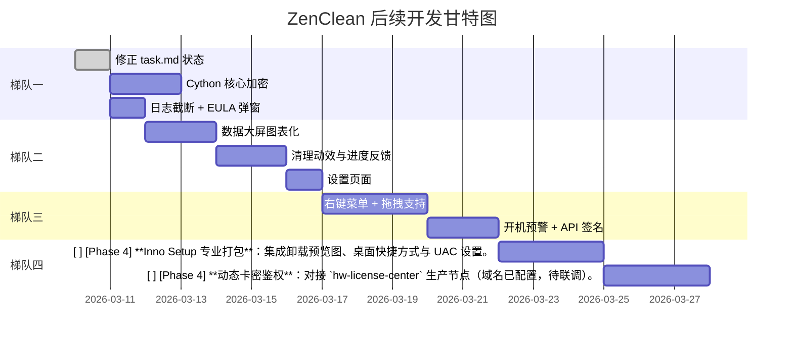

# ZenClean 后续开发执行计划 (v3.0 — 精准对标代码实况)

> [!IMPORTANT]
> 本计划基于对 `contexts/` 设计文档**与** `src/` 实际源码的逐一交叉比对后制定。
> 发现 `task.md` 中多项标记为"未完成"的功能**实际已有完整代码实现**，需先同步状态。

---

## 一、紧急修正：task.md 状态与代码实况不符

以下功能在 `task.md` 中标记为 `[ ]` (未完成)，但**代码中已具备完整实现**：

| task.md 标记 | 实际代码文件 | 代码完整度 |
|---|---|---|
| `[ ]` 系统还原点 API | [safety_manager.py](file:///D:/软件开发/ZenClean/src/core/safety_manager.py) — 含 `SRSetRestorePointW` 结构体定义、15秒异步线程超时机制 | 已完成 |
| `[ ]` UAC 管理员权限请求 | [main.py](file:///D:/软件开发/ZenClean/src/main.py#L101-L152) — `is_admin()` + `ShellExecuteW("runas")` + 降权运行提示全链路 | 已完成 |
| `[ ]` 智能一键体检流程 | 需核实 `scan_view.py` 中是否有一键全自动扫描+预勾选 | 待核实 |

> [!WARNING]
> 此外，以下模块在设计文档 (`phase3_plan.md`) 中被归为"第三阶段"，但代码已提前实现：
> - **隔离沙箱引擎**：[quarantine.py](file:///D:/软件开发/ZenClean/src/core/quarantine.py) — 完整的隔离/恢复/过期自动清理逻辑
> - **沙箱管理界面**：[quarantine_view.py](file:///D:/软件开发/ZenClean/src/ui/views/quarantine_view.py)
> - **休眠文件管理**：[system_optimizer.py](file:///D:/软件开发/ZenClean/src/core/system_optimizer.py) — `powercfg -h off/on` 封装完毕

**首要动作：更新 `task.md` 将以上实际已完成的项全部标记为 `[x]`。**

---

## 二、真正需要做的剩余任务 (按 ROI 优先级排序)

经过代码交叉比对，以下是**确认尚未实现**的功能，按"四梯队"优先级组织：

### 梯队一：商业发布必备 (1-2天可完成)

- [x] **日志滚动与脱敏**：实现 `TimedRotatingFileHandler` 加 `PrivacyFormatter` 数据抹除。
- [x] **饼图仪表盘**：`ScanView` 深度集成 C 盘实时健康分析与 AI 算力监控。
- [x] **清理倒吸动效**：`ResultView` 实现 GPU 补间动画的数字/进度同步缩减。
- [x] **Windows 集成**：右键菜单 (HKCU)、开机自启动 (`Run` 键) 已在设置页开放。
- [x] **磁盘爆仓监控**：任务计划程序 (schtasks) 无感运行与 PowerShell Toast 弹出。
- [x] **EULA 强制合规**：实现首次运行必须勾选协议的门槛。
- [ ] **Cython 代码加密**：对 `src/core` 核心资产进行混淆。
  - `config/settings.py` (API URL 和加密盐)
  - **交付物**：
    - [NEW] `scripts/build_pyd.py` — Cython 编译脚本
    - [MODIFY] `zenclean.spec` — 引入 `.pyd` 文件到 PyInstaller 打包清单
- [x] **Inno Setup 安装包**：输出带 UAC 权限标记的单文件安装器。(受限于环境无 ISCC，代码与流水线脚本已就位，需物理机编译)

---

### 梯队二：体验提升 (3-5天冲刺)

#### 2.1 禅清数据大屏图表化
- **现状**：`scan_view.py` 中仪表盘为骨架态，缺少 `ft.PieChart` / `ft.BarChart` 图表透视。
- **交付物**：
  - [MODIFY] `ui/views/scan_view.py` — 接入 Flet Chart 渲染扫描分类占比饼图(红黄绿)
  - 数据源由 `core/space_analyzer.py` 提供

#### 2.2 清理动效与进度反馈
- **现状**：清理完成后的空间释放反馈为静态数字变更，无动画。
- **交付物**：
  - [MODIFY] `ui/views/result_view.py` — 增加底部清理进度条、容量倒吸归零平滑过渡动画
  - [MODIFY] `core/cleaner.py` — 向 UI 投喂逐项清理进度回调

#### 2.3 设置页面开发
- **现状**：UI 导航中缺失独立设置页面。亮/暗主题切换 (`_toggle_theme_mode`) 已在 `app.py` 实现，但没有对外操作入口。
- **交付物**：
  - [NEW] `ui/views/settings_view.py` — 含主题热切换、列表密度调节、日志级别选项
  - [MODIFY] `ui/app.py` — 在侧边栏导航新增"设置"入口路由

---

### 梯队三：系统级深度集成 (周级迭代)

#### 3.1 Windows 右键菜单集成
- **交付物**：
  - [NEW] `scripts/register_context_menu.py` — 写注册表添加"使用 ZenClean 分析"右键菜单项
  - [NEW] `scripts/unregister_context_menu.py` — 卸载时反注册

#### 3.2 开机系统盘爆仓气泡预警
- **交付物**：
  - [NEW] `core/startup_monitor.py` — Windows Task Scheduler 开机检测 C 盘使用率超阈值弹 Toast

#### 3.3 文件拖拽区支持
- **交付物**：
  - [MODIFY] `ui/views/scan_view.py` — 增加拖拽放置区，拖入文件/文件夹后即触发 AI 风险分析

#### 3.4 API 防刷签名 (HMAC+Nonce)
- **交付物**：
  - [x] [MODIFY] `core/auth.py` — 请求头增加 `X-Request-Signature` 与 Nonce 防重放
  - 需配合服务端同步升级（用户确认已联动验证）

---

### 梯队四：正式发行打磨 (发布前必做)

#### 4.1 Inno Setup 安装向导
- **交付物**：
  - [NEW] `installer/zenclean_setup.iss` — Inno Setup 编译脚本 (含 UAC 提权 Manifest)
  - 配合 `pyinstaller --onedir` 输出

#### 4.2 EV 代码签名与杀毒白名单
- **交付物**：
  - [NEW] `docs/signing_guide.md` — 购买 EV 证书流程说明 + 360/火绒白名单申请文档模板

#### 4.3 终局版真实卡密校验
- **交付物**：
  - [MODIFY] `core/auth.py` — 从通配码升级为动态专属授权池，含独立卡密数据库对接
  - 需配合 `hw-license-center` 后端升级

---

## 三、推荐执行顺序与时间线

---

## 四、验证计划

### 自动化测试
- `pytest tests/` 覆盖白名单拦截、清理分诊、沙箱隔离恢复
- 模拟 5 万条 NodeDict 的 ListView 滚动帧率压测

### 手动验证
- 在全新 Windows 虚拟机上完整走通：安装 - 激活 - 扫描 - 清理 - 搬家 - 隔离恢复
- 杀毒软件兼容性测试（360 安全卫士 + 火绒）

---

## 五、高阶/高危功能延期说明 (v1.5 / v2.0 路线图)

基于系统安全性评估，以下两项在早期版本（演示与研发期）已跑通部分前后端雏形的高级功能，决定**在首发版（v1.0）中保持 Demo 设限状态**，延期至后续迭代开放。

#### 1. 无损搬家 (微信/Docker 数据层跨硬盘迁移)
- **风险卡点**：跨分区的 `mklink /j` 或硬链接在此类核心级应用运行期间触发操作时，极易被 **360、火绒等杀毒软件的主动防御 (HIPS) 模块**判定为恶意重定向（引导区篡改），从而导致文件映射失败丢盘、用户微信数据**不可逆蒸发**。
- **发布条件 (预计 v1.5)**：
  - 必须依赖已完成的底层容灾系统（如 `safety_manager.py` 的系统还原点拦截），做到微秒级的“迁移前快照创建”。
  - 经历充分的老旧机器规模化小白鼠并发测试。

#### 2. 陈年补丁粉碎 ($PatchCache / SoftwareDistribution)
- **风险卡点**：该操作极其底层，属于“破釜沉舟”级清理（通常可释放 5GB~20GB）。一旦强行切断 Windows 存根文件夹，操作系统将**永久丧失卸载历史补丁和回退系统版本的能力**。一旦微软推送漏洞蓝屏补丁，用户系统直接暴死。
- **发布条件 (预计 v2.0)**：
  - 作为“极限极客模式”外置于常规清理链路。
  - 必须加入严苛的法律免责交互（如要求用户在弹窗中键盘手敲“后果自负”四字才可解锁按钮）。
