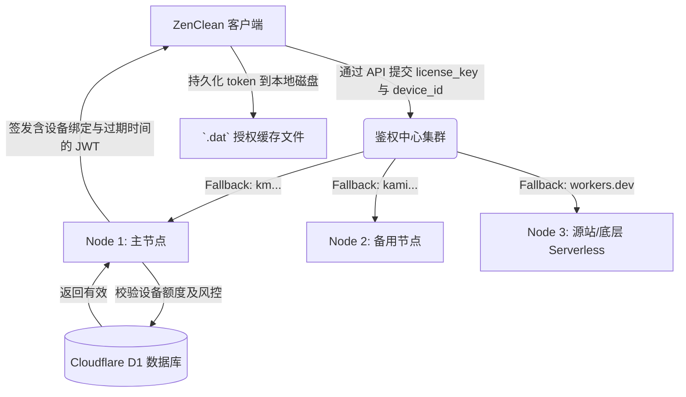

# ZenClean 商业化鉴权中心 (hw-license-center) 接入说明文档

本文档详细说明了 ZenClean 客户端是如何与 `hw-license-center` 云端授权系统协同工作的，以及未来的架构扩展建议。

## 1. 架构概述

本系统的鉴权体系采用 **“强在线绑定” + “弱离线续签 (JWT Token 缓存)”** 相结合的混合模式。

## 2. 核心模块与文件

### 2.1 依赖组件 (`requirements.txt`)
- `requests`: 用于与授权中心产生 HTTP/JSON 交互。
- `py-machineid`: 用于提取当前操作系统的底层硬件 ID 唯一标识 (`device_id`)。
- `PyJWT`: 本地 JWT 解码验证引擎（主要验证过期时间和负载，断网验证时关闭签名强校验）。

### 2.2 核心配置文件 (`src/config/settings.py`)
定义了系统级的常量与参数：
- `LICENSE_SERVER_URLS`: 高可用节点列表。为了防止单点故障（如某域名被墙或被攻击），支持多节点依次重试（Fallback 路由）。
- `AUTH_DAT_PATH`: 本地持久化缓存 JWT Token 的存放路径。
- `NTP_MAX_DRIFT_SECONDS`: 离线校验时与远端 HTTP(S) Server Date 的容忍漂移秒数，用于防本地时间篡改漏洞。
- `LICENSE_PRODUCT_ID`: 指定本软件在云端的标识（当前为 `zenclean`）。

### 2.3 鉴权引擎驱动 (`src/core/auth.py`)
这是整个授权业务的“大脑”，核心流程如下：
1. **获取机器识别码**：`get_device_id()` 提供唯一稳定的设备指纹。
2. **防回退时间戳攻击**：`_check_time_drift()` 探针：每次启动应用，如果有网会读取服务端的标准时间校验本地时间是否被用户篡改。
3. **在线鉴权主路由**：`verify_license_online(license_key)` 封装了带有 Fallback 机制的在线验证与本地 Token 签发写入。
4. **离线与重启效验**：`check_local_auth_status()` 用于每次启动软件时的无缝核验：
   - 如果存在缓存并且本机时间没有被造假，则解析 JWT 中的 `device_id` 与本机对比。
   - 对比时间戳 `exp` 是否未过期。
   - 两者符合即静默通过，不需要再次向云端发请求。

### 2.4 UI 耦合 (`src/ui/app.py` & `auth_view.py`)
- `ZenCleanApp.__init__` 启动之初立即调用 `check_local_auth_status()` 拦截状态。如果过签则内部变量 `self.is_activated = True`。
- `auth_view.py` 处理用户手动在 UI 里面粘贴的卡密数据，提交成功后联动更新界面按钮等关键权限。

## 3. 下一步优化方向 (Phase 2 Roadmap)
1. **代码混淆防护 (PyArmor/Cython)**：当前验证代码是明文存在于 Python 中的，下一步需将 `auth.py` 及核心逻辑打包编译为不可直接反汇编的 pyd 或二进制模块。
2. **加密型 Token 存储结构**：目前的 JWT 会被明文写在磁盘上（客户端无 secret 时虽无法伪造，但可以被明文分析结构）。后期计划将 token 本身经过机器码异或或 AES 对称加密后再落盘存储。
3. **静默背景心跳验证**：当前只有启动应用和触发核心操作前做鉴权检测，未来可加入后台周期性校验（间隔如 4 小时），及时侦测“服务端已取消此卡密授权”的操作并实施踢线拦截。
